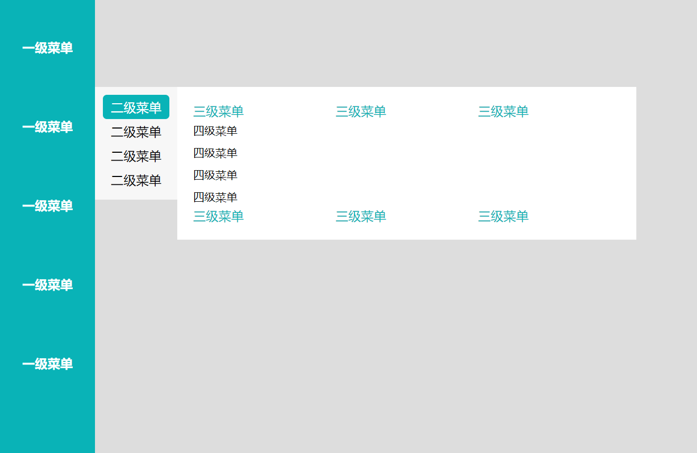

# NavMenu 导航菜单
## 效果图



## 通过传入树形数据，渲染出菜单
> 一个简单初版的导航菜单，只是做着玩，因为用不上，同时感觉设计的不是很好，就懒得继续完善了  
> 觉得合适使用的朋友可以自取，也可以联系我加上你所需要的功能，一起完善组件
## 使用方式
复制 `XiaopMenu.vue` 文件到你的项目中即可使用  

`<xiaop-menu :menu="munus" childrenPropertyName="childrenMenus"/>`

### Attribute
| 参数 | 说明 | 类型 | 可选值 | 默认值 |
| --- | --- | --- | --- | --- |
| menu | 树形结构菜单 | Array | — | [ ] |
| childrenPropertyName| 指定子菜单列表字段名称 | String | — | childrenMenus |
| title| 指定菜单名称显示字段 | String | — | title |

### 模拟数据结构
```javaScript
const munus = [
  {
    menuId: 33,
    name: '一级菜单',
    parentId: 32,
    path: '/path/hahahah',
    childrenMenus: []
  },
  {
    menuId: 34,
    name: '一级菜单',
    parentId: 32,
    childrenMenus: [
      {
        menuId: 35,
        name: '二级菜单',
        parentId: 34,
        path: '/path/hahahah',
        childrenMenus: [
          {
            menuId: 35,
            name: '三级菜单',
            parentId: 34,
            path: '/path/hahahah',
            childrenMenus: [
              {
                menuId: 35,
                name: '四级菜单',
                parentId: 34,
                path: '/path/hahahah',
                childrenMenus: []
              },
              {
                menuId: 36,
                name: '四级菜单',
                parentId: 34,
                path: '/path/hahahah',
                childrenMenus: []
              },
              {
                menuId: 163,
                name: '四级菜单',
                parentId: 34,
                path: '/path/hahahah',
                childrenMenus: []
              },
              {
                menuId: 198,
                name: '四级菜单',
                parentId: 34,
                path: '/path/hahahah',
                childrenMenus: []
              }
            ]
          },
          {
            menuId: 36,
            name: '三级菜单',
            parentId: 34,
            path: '/path/hahahah',
            childrenMenus: []
          },
          {
            menuId: 163,
            name: '三级菜单',
            parentId: 34,
            path: '/path/hahahah',
            childrenMenus: []
          },
          {
            menuId: 198,
            name: '三级菜单',
            parentId: 34,
            path: '/path/hahahah',
            childrenMenus: []
          }
        ]
      },
      {
        menuId: 36,
        name: '二级菜单',
        parentId: 34,
        path: '/path/hahahah',
        childrenMenus: [
          {
            menuId: 35,
            name: '三级菜单',
            parentId: 34,
            path: '/path/hahahah',
            childrenMenus: [
              {
                menuId: 35,
                name: '四级菜单',
                parentId: 34,
                path: '/path/hahahah',
                childrenMenus: []
              },
              {
                menuId: 36,
                name: '四级菜单',
                parentId: 34,
                path: '/path/hahahah',
                childrenMenus: []
              }
            ]
          },
          {
            menuId: 36,
            name: '三级菜单',
            parentId: 34,
            path: '/path/hahahah',
            childrenMenus: []
          },
          {
            menuId: 163,
            name: '三级菜单',
            parentId: 34,
            path: '/path/hahahah',
            childrenMenus: []
          },
          {
            menuId: 198,
            name: '三级菜单',
            parentId: 34,
            path: '/path/hahahah',
            childrenMenus: []
          },
          {
            menuId: 163,
            name: '三级菜单',
            parentId: 34,
            path: '/path/hahahah',
            childrenMenus: []
          },
          {
            menuId: 198,
            name: '三级菜单',
            parentId: 34,
            path: '/path/hahahah',
            childrenMenus: []
          }
        ]
      },
      {
        menuId: 163,
        name: '二级菜单',
        parentId: 34,
        path: '/path/hahahah',
        childrenMenus: []
      },
    ]
  },
]
export default munus
```